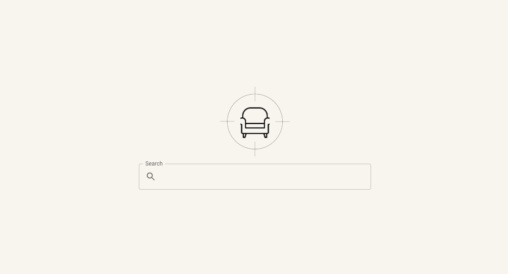

# Furniture Hunt 🪑

A modern web application for searching and comparing furniture prices across multiple online retailers. Built with Next.js and Material-UI, this frontend application provides a clean, intuitive interface for finding the best furniture deals.



## Features

🔍 **Smart Search** - Search for furniture items across multiple stores simultaneously  
🏪 **Multi-Store Comparison** - Compare prices from various furniture retailers  
🎯 **Advanced Filtering** - Filter results by store, price range, and other criteria  
📱 **Responsive Design** - Works seamlessly on desktop, tablet, and mobile devices  
⚡ **Fast Loading** - Optimized performance with Next.js and server-side rendering  
🎨 **Modern UI** - Clean, intuitive interface built with Material-UI components

## Getting Started

### Prerequisites

- Node.js 16.x or higher
- npm or yarn package manager
- A running backend API server (furniture-scan-api)

### Installation

1. **Clone the repository**

   ```bash
   git clone https://github.com/your-username/furniture-scan-front.git
   cd furniture-scan-front
   ```

2. **Install dependencies**

   ```bash
   npm install
   # or
   yarn install
   ```

3. **Set up environment variables**

   ```bash
   cp .env.example .env.local
   ```

   Edit `.env.local` and configure your API endpoints:

   ```bash
   SCANNER_API_PORT=3000
   SCANNER_API=http://localhost:3000
   ```

4. **Start the development server**

   ```bash
   npm run dev
   # or
   yarn dev
   ```

5. **Open your browser**
   Navigate to [http://localhost:8080](http://localhost:8080) to see the application.

## Running the Application

### Development Mode

```bash
npm run dev
```

Starts the development server on port 8080 with hot reloading enabled.

### Production Build

```bash
npm run build
npm run start
```

Builds the application for production and starts the production server.

### Testing the Application

1. **Manual Testing**

   - Visit [http://localhost:8080](http://localhost:8080)
   - Try searching for furniture items (e.g., "chair", "table", "sofa")
   - Test the filtering functionality
   - Verify responsive design on different screen sizes

2. **Verify Features**

   - ✅ Search functionality works
   - ✅ Results display properly
   - ✅ Filtering by store works
   - ✅ Price sorting works
   - ✅ Product links open correctly
   - ✅ Loading states display
   - ✅ Error handling works

3. **API Integration Test**
   ```bash
   # Test API connectivity
   curl http://localhost:3000/scan?search=chair
   ```

## Project Structure

```
furniture-scan-front/
├── public/
│   └── logo.svg              # Application logo
├── src/
│   ├── components/
│   │   ├── layout.tsx         # Main layout component
│   │   ├── loading.tsx        # Loading spinner component
│   │   └── search.tsx         # Search input component
│   └── pages/
│       ├── _app.tsx           # Next.js app wrapper
│       ├── _document.tsx      # HTML document structure
│       ├── index.tsx          # Home page
│       ├── global.css         # Global styles
│       └── search/
│           └── [keyword]/
│               └── index.tsx  # Search results page
├── .env.example              # Environment variables template
├── .env.local               # Local environment config (not in git)
├── next.config.js           # Next.js configuration
├── package.json             # Dependencies and scripts
├── tailwind.config.js       # Tailwind CSS configuration
└── tsconfig.json           # TypeScript configuration
```

## Built With

- **[Next.js 13](https://nextjs.org/)** - React framework for production
- **[React 18](https://reactjs.org/)** - Frontend library
- **[TypeScript](https://www.typescriptlang.org/)** - Type-safe JavaScript
- **[Material-UI (MUI)](https://mui.com/)** - React UI component library
- **[Emotion](https://emotion.sh/)** - CSS-in-JS library for styling
- **[Tailwind CSS](https://tailwindcss.com/)** - Utility-first CSS framework

## Available Scripts

| Script          | Description                           |
| --------------- | ------------------------------------- |
| `npm run dev`   | Start development server on port 8080 |
| `npm run build` | Build the application for production  |
| `npm run start` | Start the production server           |
| `npm run lint`  | Run ESLint to check code quality      |

## Configuration

### Environment Variables

| Variable           | Description      | Default               |
| ------------------ | ---------------- | --------------------- |
| `SCANNER_API_PORT` | Backend API port | 3000                  |
| `SCANNER_API`      | Backend API URL  | http://localhost:3000 |

### Supported Stores

The application fetches data from multiple furniture retailers:

- IKEA
- Costco
- Ashley Furniture
- And more...

## API Integration

This frontend requires a backend API server that provides furniture search functionality. The expected API format:

```typescript
// GET /scan?search={keyword}
{
  "items": [
    {
      "id": 1,
      "name": "Product Name",
      "price": "$299.99",
      "imageUrl": "https://...",
      "productLink": "https://...",
      "storeName": "IKEA",
      "scrapedAt": "2024-01-01T00:00:00Z"
    }
  ]
}
```

## Troubleshooting

### Common Issues

**Port already in use**

```bash
# Kill process using port 8080
lsof -ti:8080 | xargs kill -9
```

**API connection issues**

- Verify the backend server is running
- Check your `.env.local` configuration
- Ensure firewall settings allow the connection

**Build errors**

```bash
# Clear Next.js cache
rm -rf .next
npm run build
```

## Contributing

1. Fork the repository
2. Create a feature branch (`git checkout -b feature/amazing-feature`)
3. Commit your changes (`git commit -m 'Add amazing feature'`)
4. Push to the branch (`git push origin feature/amazing-feature`)
5. Open a Pull Request

## License

This project is licensed under the MIT License - see the [LICENSE](LICENSE) file for details.

## Acknowledgments

- Material-UI team for the excellent component library
- Next.js team for the amazing React framework
- All contributors who help improve this project
